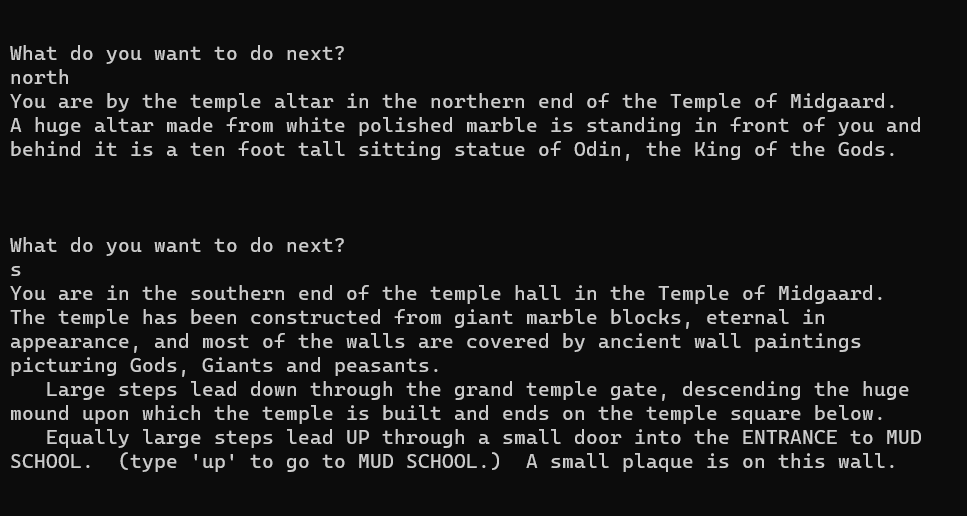

# mud
A multi user dungeon server for players to connect to over telnet to explore a classic merk derivative world. This was built for my distributed systems class at Utah Tech University.  In this mud there are no enemies you just get to peacefully explore the world with friends.

Built using go with sockets using the go standard library sockets.

